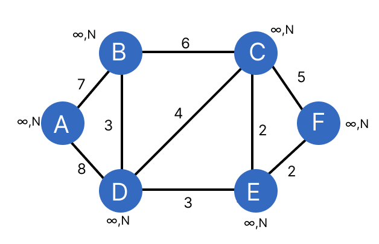
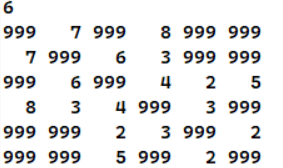

# Greedy Algorithms

## Introduction

Greedy algorithms follow a problem-solving heuristic of making the locally optimal choice at each stage with the hope of finding a global optimum. They are simple, intuitive, and often efficient, but they do not always produce the best solution for complex problems.

## Examples of Greedy Algorithms

1. **Dijkstra's Algorithm**: Used for finding the shortest path in a graph from a starting node to all other nodes.
2. **Kruskal's Algorithm**: Used for finding the minimum spanning tree of a graph.
3. **Fractional Knapsack**: This problem can be solved by greedy strategy by taking items with the highest $\frac{value}{weight}$ ratio first.
4. **Prim's Algorithm**: A greedy algorithm that finds a minimum spanning tree for a weighted undirected graph. It starts from a random vertex and greedily grows the tree by adding the minimum weight edge from the tree to the graph.
5. **Job Scheduling Problem**: Jobs are scheduled based on their deadlines and durations to maximize profit or minimize penalty.

## Prim's Algorithm
Prim's Algorithm is a greedy approach to find the minimal spanning tree for a given graph.

**Initialization:**
Three sets namely key, parent and mstSet are taken each with length = no of vertices of the graph. Each of the elements of the sets are initialized as follows:
key[] with 999 and parent[] and mstSet[] with 0.

**Procedure:**
All vertices are assigned a key and parent value. Any of the vertex of the graph is selected as the starting vertex and its key value is assigned 0. Then check for the unvisited adjacent vertices and if their key values are greter than the weight of the edge joining it and the chosen vertex, then update its key value equivalent to the weight value. Continue this procedure until all the vertices are visited.

Finally, the cost set would contain the minimum path weights and adding it's elements would give the minimum cost of the spanning tree and the mstSet contains the parent value of each vertex which finaaly gives the edge sets of the MST.

**Algorithm:**
```c
void Prim(G,w,r){
    for each vertex u ∈ G(V ){
        key[u] := ∞; // Initialization
        parent[u] := nil;
        mstSet[u] := false;
    }
    key[r] := 0; // Start from root
    //Make a min priority Queue Q; // min-heap is used 
    //for min priority Queue
    while Q is not empty{
        // Until all vertices in MST
        u := ExtractM in(Q); // Delete a minimum valued 
        //vertex from heap
        mstSet[u] := true;
        for each v adjacent from u{
            if mstSet[v] = false and w[u, v] < key[v]{
                DecreaseKey(v, w[u][v]); // Update heap
                parent[v] := u;
            }
        }
    }
}
```

**Working:**
The following graph is used to demonstrate Prim's Algorithm.




## Advantages of Greedy Algorithms

- They are easy to understand and implement.
- They often have lower computational complexity than other algorithms.

## Disadvantages of Greedy Algorithms

- They do not always provide the most optimal solution.
- They can be easily misled by problems where the obvious choice isn't always the best.

## Conclusion

While greedy algorithms may not always provide the most optimal solution, they are a valuable tool in the programmer's toolkit due to their simplicity and efficiency. Understanding when to use a greedy approach is key to being able to effectively solve problems.

## References

- [GeeksforGeeks - Greedy Algorithms](https://www.geeksforgeeks.org/greedy-algorithms/)
- [Wikipedia - Greedy Algorithm](https://en.wikipedia.org/wiki/Greedy_algorithm)

## License

This project is licensed under the terms of the MIT license.